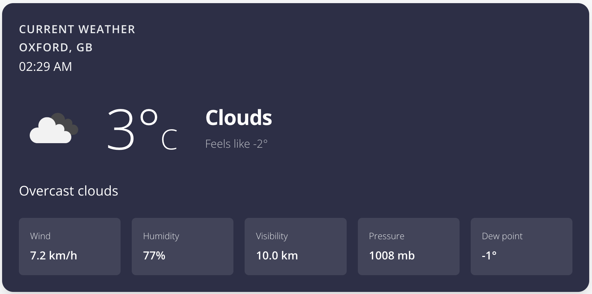
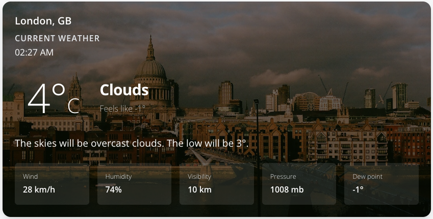
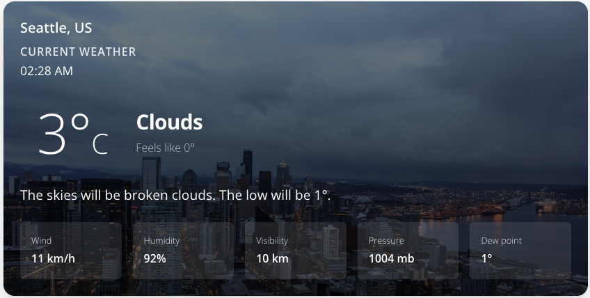
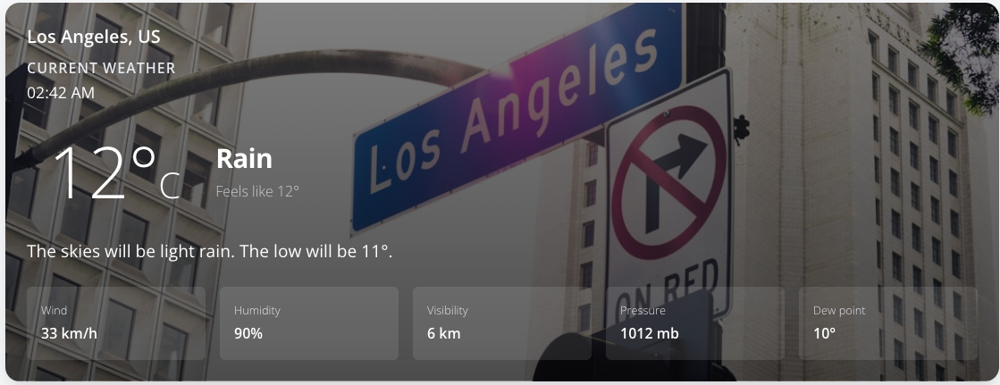
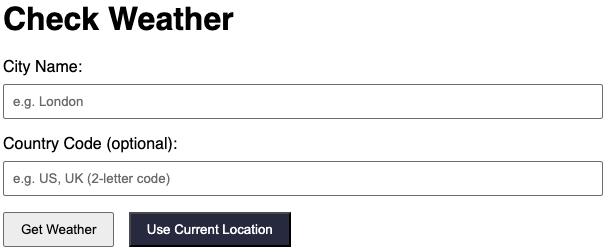
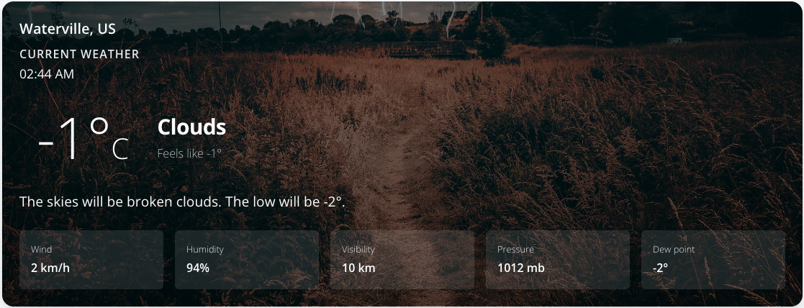

# Weather App Report

## Abstract
This project involved transforming a static HTML template into a dynamic Flask web application that provides real-time weather information. By integrating the OpenWeatherMap API, the application now allows users to search for weather conditions in any city worldwide. The dashboard dynamically renders key metrics such as temperature, humidity, wind speed, and visibility. Additionally, the application includes robust error handling to manage invalid inputs or API failures gracefully, ensuring a smooth user experience.

## Results
The core deliverable was to create a functional weather dashboard that accepts user input and displays dynamic data.

### 1. Dynamic Weather Dashboard
The `dashboard.html` template was updated to use Jinja2 templating to display weather data passed from the Flask backend. The `routes.py` file was modified to handle form submissions, query the OpenWeatherMap API, process the JSON response (e.g., converting units, mapping weather codes to FontAwesome icons), and handle errors.

## Extensions
I undertook two major extensions to enhance the functionality and aesthetics of the application.

### 1. Geolocation Integration
I used JavaScript to automatically detect the user's Latitude and Longitude from the browser.
- **Functionality**: Added a "Use Current Location" button on the home page. When clicked, it triggers the browser's Geolocation API.
- **Backend Flow**: The coordinates are sent to the backend, which uses OpenWeatherMap's Reverse Geocoding API to determine the location name (City, Country) and then fetches the weather data for those coordinates.

### 2. Context-Aware Background Images
I used the Unsplash API to pull an image of the current city and weather conditions.
- **Functionality**: The backend constructs a search query using the city name and the weather description (e.g., "London clear sky").
- **Visuals**: The retrieved image is applied as the background of the weather card with a dark gradient overlay to ensure text readability. This makes the dashboard feel more immersive and personalized.

## References & Acknowledgements
- **OpenWeatherMap API**: For providing real-time weather data and geocoding services.
- **Unsplash API**: For providing the dynamic background images.
- **Flask**: The Python web framework used to build the application.
- **Creative Tim**: For the Argon Dashboard frontend template.
- **AI Assistance**: Generative AI tools were used to assist in debugging code, generating unit tests to achieve high coverage, and refining the implementation logic.
